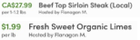

# FarmlyPortal

The Farmly Portal was developed to help Farmers impacted by Covid-19 sell their products directly to consumer by improving the food delivery process.

Farmers that have the resources to deliver products, can easily add their delivery trucks. They can also specify which radius they are able to deliver too, and pick up products from.

Everytime a user makes a purchase on the Farmly marketplace, the product's delivery is scheduled and assigned to a truck to schedule the delivery.

The delivery is scheduled to ensure the optimal route(shortest path across multiple pick up and delivery locations) as well as food safety(cross-contaminated products are not assigned to the same trucks)

Farmers can then view their delivery routes for a given delivery date, as well as the inventory of that delivery.

